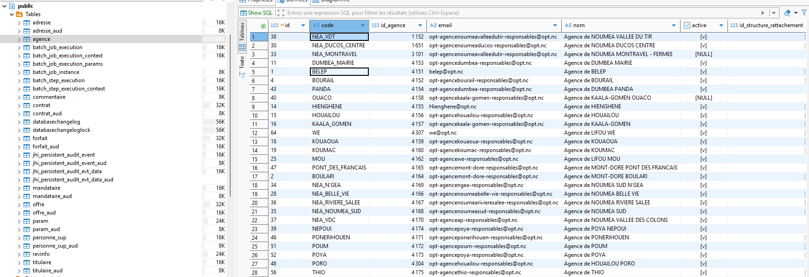

# Documentation — Connexion à la base de données (PostgreSQL via Docker + DBeaver + IntelliJ)

## Objectif
Permettre d’explorer la base de données du projet à l’aide de :
- **DBeaver** (exécution et exploration SQL)
- **IntelliJ IDEA** (intégration IDE — SQL autocompletion)

---

## 1. Configuration Docker

La base de données PostgreSQL est lancée via un conteneur Docker à partir du fichier :

```

/docker/postgresql.yml

````

paramètres importants utilisés :

```yaml
version: '3.8'
services:
  sior-postgresql:
    image: postgres:14.5
    # volumes:
    #   - ~/volumes/jhipster/sior/postgresql/:/var/lib/postgresql/data/
    environment:
      - POSTGRES_DB=sior
      - POSTGRES_USER=sior_adm
      - POSTGRES_PASSWORD=
      - POSTGRES_HOST_AUTH_METHOD=trust
    # If you want to expose these ports outside your dev PC,
    # remove the "127.0.0.1:" prefix
    ports:
      - 127.0.0.1:5432:5432

````

Cela signifie que PostgreSQL est accessible sur :

| Élément  | Valeur         |
| -------- | -------------- |
| Host     | `localhost`    |
| Port     | `5432`         |
| Database | `sior`       |
| Username | `sior_adm`     |
| Password | `"pas de MDP"` |

---

## 2. Connexion dans DBeaver

### Étapes réalisées

1. Ouvrir **DBeaver**
2. Clic droit sur **Database** → **New Database Connection**
3. Choisir **PostgreSQL**
4. Renseigner les informations suivantes :

| Champ    | Valeur renseignée |
| -------- | ----------------- |
| Host     | `localhost`       |
| Port     | `5432`            |
| Database | `sior`          |
| Username | `sior_adm`        |
| Password | `"pas de MDP"`    |

### Résultat obtenu

- La connexion a été établie avec succès.
- Les tables sont visibles et les données peuvent être consultées.



---

## 3. Connexion dans IntelliJ IDEA

### Version utilisée : IntelliJ IDEA Community Edition

Lors de la tentative de connexion à la base PostgreSQL dans IntelliJ, j’ai constaté que
**la fonctionnalité “Database Tools and SQL” (fenêtre Database) n’est pas disponible dans la version Community**,
car elle est **réservée à IntelliJ IDEA Ultimate** uniquement.

➡️ Il n’est donc **pas possible d’utiliser l’interface base de données intégrée** dans ma version actuelle.
➡️ En revanche, **il serait possible dans IntelliJ Ultimate**, via :

```
View → Tool Windows → Database → + → PostgreSQL
```

📌 À ce stade, j’ai choisi d’utiliser uniquement **DBeaver**, qui couvre entièrement l’exploration SQL.

📸 **Capture éventuelle ici (si besoin)**

---

## ✅ Conclusion

* La connexion Docker → PostgreSQL → DBeaver est **fonctionnelle et validée** ✅
* La connexion dans IntelliJ n’est **pas possible dans la version Community** (fonctionnalité réservée à Ultimate)
* La base peut être **explorée et interrogée directement via DBeaver sans blocage**

---

```

---

Veux-tu maintenant que je t’aide à faire **les captures qu’il faut exactement**, avec **quoi montrer à l’écran pour que ça fasse “pro”** dans un rapport ?
```
