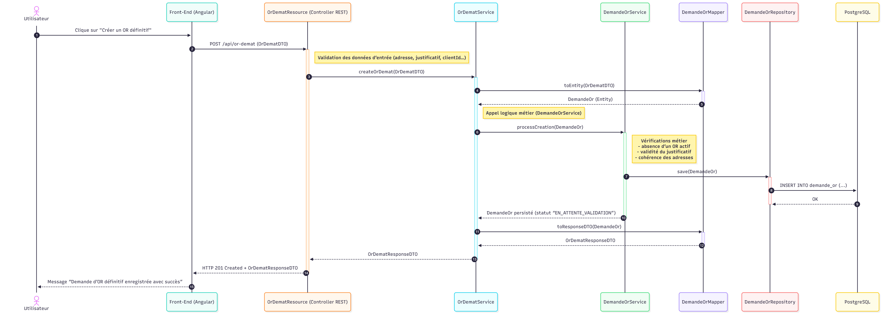
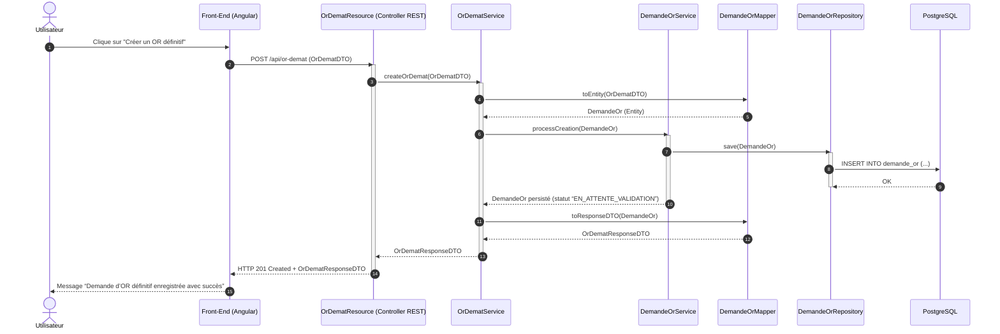

# Explication du diagramme de séquence — OR Définitif (Création)

Ce diagramme représente **le parcours complet de création d’un Ordre de Réexpédition Définitif (OR-Démat)** dans le SIOR.  
Il illustre les **échanges entre les différentes couches techniques**, depuis l’action de l’utilisateur jusqu’à la persistance de la demande en base de données (`demande_or`).

---

## Acteurs présents dans le diagramme

| Acteur | Rôle |
|--------|------|
| **Utilisateur** | Déclenche la création de l’OR définitif depuis l’interface web |
| **Front-End (Angular)** | Envoie la requête HTTP POST vers le back-end |
| **OrDematResource** | Contrôleur REST Spring Boot, point d’entrée `/api/or-demat` |
| **OrDematService** | Service métier principal orchestrant la création |
| **DemandeOrService** | Service métier spécifique à la gestion de l’OR définitif |
| **DemandeOrMapper** | Assure la conversion DTO ↔ Entité |
| **DemandeOrRepository** | Gère les opérations JPA/Hibernate vers la table `demande_or` |
| **PostgreSQL** | Base de données relationnelle où est stockée la demande d’OR |

---

## Déroulement du traitement (étape par étape)

1. **L’utilisateur clique sur “Créer un OR définitif”**  
   → L’action démarre depuis l’interface Angular.  

2. Le **Front-End (Angular)** envoie la requête REST :  
   → `POST /api/or-demat` avec un corps JSON conforme à `OrDematDTO`.

3. Le **contrôleur `OrDematResource`** reçoit la requête.  
   → Il effectue une validation des champs d’entrée (adresse, justificatif, identifiant client…).  
   → Puis il appelle la méthode `createOrDemat()` du service.  

4. Le **`OrDematService`** transforme le DTO en entité via le `DemandeOrMapper` :
   ```java
   DemandeOr demandeOr = demandeOrMapper.toEntity(orDematDTO);
5. Le service délègue ensuite la création à la logique métier `DemandeOrService.processCreation()`.

6. Le **`DemandeOrService`** effectue les vérifications métiers :

   * Absence d’un OR déjà actif pour le client,
   * Validité du justificatif,
   * Cohérence des adresses (origine/destination).

7. Si les validations sont conformes, le **`DemandeOrRepository`** enregistre la demande :

   ```sql
   INSERT INTO demande_or (...)
   ```

   → Le statut initial est défini à `EN_ATTENTE_VALIDATION`.

8. **PostgreSQL** confirme l’insertion (OK).
   → L’entité persistée (avec son `id` et son statut) est renvoyée au service.

9. Le **mapper** reconvertit l’entité persistée en `OrDematResponseDTO`.

10. Le **contrôleur `OrDematResource`** renvoie la réponse HTTP :
    → `HTTP 201 Created` avec le `OrDematResponseDTO`.

11. Le **Front-End Angular** affiche à l’utilisateur :

    > *“Demande d’OR définitif enregistrée avec succès”*

---

## En résumé

Ce diagramme démontre :

* La **séparation claire des responsabilités** : *Controller → Service → Repository → Database*
* L’ajout d’une **couche métier intermédiaire (`DemandeOrService`)** dédiée à la validation et cohérence métier.
* Une **traçabilité complète** depuis la requête utilisateur jusqu’à la persistance de la donnée.
* Le respect des bonnes pratiques Spring Boot :

  * Contrôleur sans logique métier
  * DTOs gérés via Mapper
  * Services responsables des règles métiers
  * Repositories dédiés à la persistence

---

## Points clés techniques

* **Statut initial** de la demande : `EN_ATTENTE_VALIDATION`
* **Entité cible en base** : `demande_or`
* **Endpoint utilisé** : `POST /api/or-demat`
* **Réponse HTTP** : `201 Created + OrDematResponseDTO`
* **Tests d’intégration associés** : `OrDematResourceIT`

---

## Diagramme de séquence — Création OR Définitif



---

## Code du diagramme (Mermaid)


