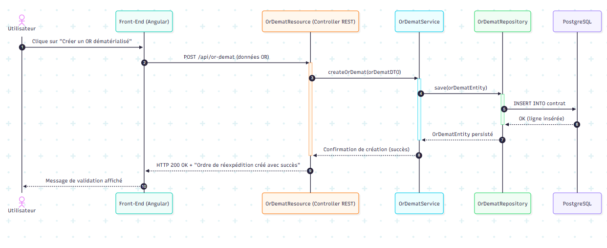

# Explication du diagramme de séquence — OR Démat (Création)

Ce diagramme représente **le parcours complet d'une création d’Ordre de Réexpédition dématérialisé (OR-Démat)** dans le SIOR.

Il illustre **les échanges entre chaque couche technique**, depuis l’action de l’utilisateur jusqu’à l’enregistrement en base de données.

---

## Acteurs présents dans le diagramme

| Acteur | Rôle |
|--------|------|
| **Utilisateur** | Interagit depuis l’interface web |
| **Front-End (Angular)** | Envoie la requête HTTP au back-end REST |
| **OrDematResource** | Contrôleur REST Spring Boot (reçoit l’API) |
| **OrDematService** | Contient la **logique métier** de l’OR |
| **OrDematRepository** | Fait les accès directs à la base de données |
| **PostgreSQL** | Base de données où l’OR est enregistré |

---

## Déroulement de l’échange (étape par étape)

1. **L'utilisateur clique sur “Créer un OR dématérialisé”**  
2. Le **Front Angular envoie une requête REST** :  
   → `POST /api/or-demat` avec les données de l’OR  
3. Le **Contrôleur `OrDematResource` reçoit la requête**  
   → il ne contient aucune logique métier : il **transfère au Service**  
4. Le **Service `OrDematService` prépare et valide les données**  
   → puis appelle le Repository pour enregistrer en base  
5. Le **Repository `OrDematRepository` exécute un INSERT SQL**  
   → enregistre réellement l’OR dans PostgreSQL  
6. **La base confirme la sauvegarde** → retour successif Repository → Service → Controller  
7. Le **Controller renvoie une réponse HTTP 200 OK**  
   → exemple : `"Ordre de réexpédition créé avec succès"`  
8. Le **Front affiche un message de confirmation à l’utilisateur**

---

## En résumé

Ce diagramme permet de visualiser :

- **le flux complet de la requête**
- **la séparation claire des responsabilités** (*Controller → Service → Repository → Database*)
- **l’absence totale de logique métier dans le Controller**
- **la conformité à une architecture Spring Boot propre (REST + Service + JPA)**

Il prouve que **chaque couche joue correctement son rôle**, et garantit que **l’application est scalable, maintenable et testable**.

## Annexe

le code pour le diagramme dans mermaid live editor 

## diagramme de séquence — OR Démat (Création)

