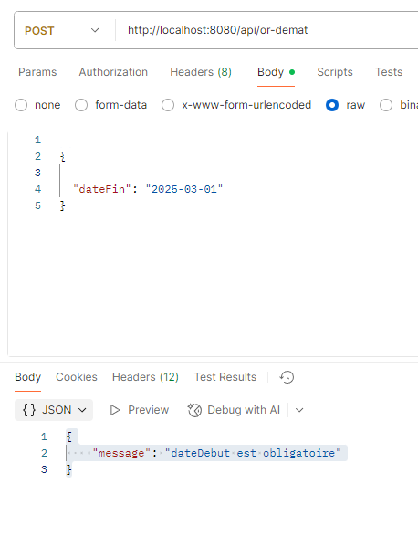
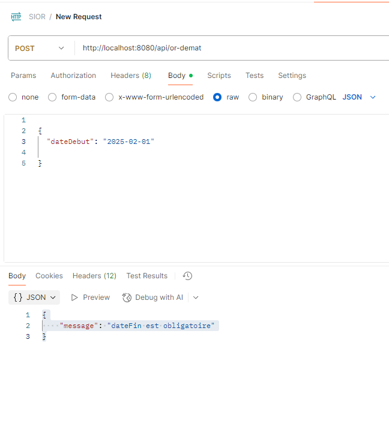
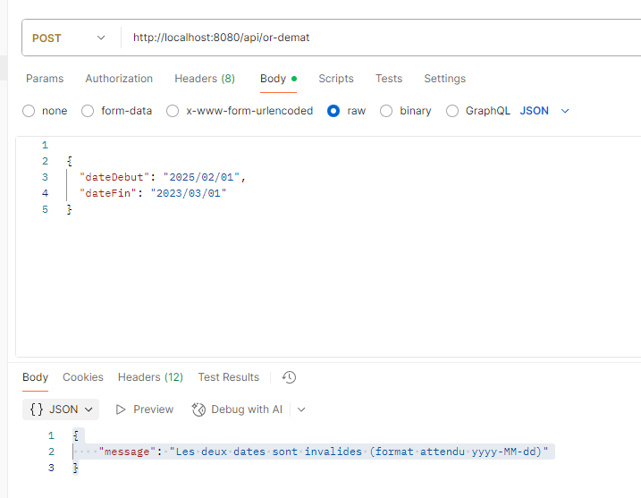
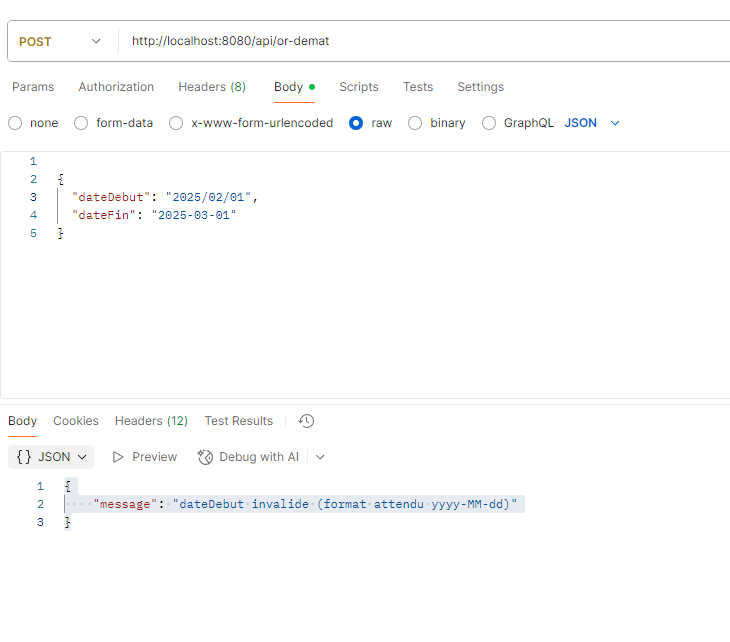
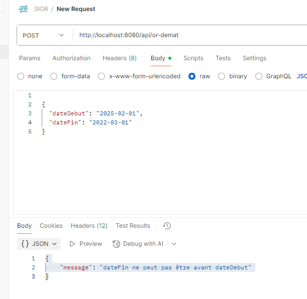

# Réalisation de l’API REST — POST `/api/or-demat`


## Objectif

Créer une **API Spring Boot** répondant à l’URI :

```

POST /api/or-demat

````

Cette API doit :

✅ Recevoir un JSON contenant `dateDebut` et `dateFin`  
✅ Valider les champs  
✅ Retourner un JSON de confirmation avec **message** et les **dates reçues**  
✅ Répondre `201 Created` si succès  
✅ Répondre `400 Bad Request` si erreur  
✅ Être **testée via Postman et MockMvc**

---

## 🧱 Classes Java à créer

| Fichier | Rôle |
|---------|------|
| `OrDematDTO` | Représente **le JSON reçu** (entrée) |
| `OrDematResponseDTO` | Représente **le JSON renvoyé** (sortie) |
| `OrDematService` | Contient **la logique métier** (validation...) |
| `OrDematResource` | **Contrôleur REST** qui expose l’endpoint |
| `OrDematResourceTest` | **Test unitaire** avec MockMvc |

on doit aussi  **modifier la sécurité** (`SecurityConfiguration`) pour autoriser cet endpoint.

---

## Étapes de réalisation

### 1️) Créer le DTO d’entrée (`OrDematDTO`)
```java
src/main/java/.../service/dto/OrDematDTO.java
````

→ Contient `dateDebut`, `dateFin` (JSON reçu depuis Postman ou Angular)

---

### 2️) Créer le DTO de réponse (`OrDematResponseDTO`)

```java
src/main/java/.../service/dto/OrDematResponseDTO.java
```

→ Contiendra `dateDebut`, `dateFin`, `message`

---

### 3️) Créer le service (`OrDematService`)

```java
src/main/java/.../service/OrDematService.java
```

→ Rôle :

* Valider les champs
* Gérer les erreurs
* Construire la réponse finale

---

### 4️) Créer le contrôleur REST (`OrDematResource`)

```java
src/main/java/.../web/rest/OrDematResource.java
```

→ Reçoit la requête POST `/api/or-demat`
→ Appelle le service
→ Retourne `201` ou `400`

---

### 5️) Modifier la sécurité

Dans `SecurityConfiguration.java`, ajouter :

```java
.antMatchers("/api/or-demat").permitAll()
```

→ À placer **avant** `.antMatchers("/api/**").authenticated()`

---

### 6️) Écrire les tests (`OrDematResourceTest`)

```java
src/test/java/.../web/rest/OrDematResourceTest.java
```

→ Tester **succès (201)**
→ Tester **erreur (400)**
→ Utiliser **MockMvc standalone**

---

### 7️) Vérifier l’API avec Postman

URL : `http://localhost:8080/api/or-demat`
Méthode : `POST`
Body → `raw` → `JSON`

```json
{
  "dateDebut": "2025-02-01",
  "dateFin": "2025-03-01"
}
```

---

## Résultat attendu

| Scénario                             | Réponse                           |
| ------------------------------------ | --------------------------------- |
| **Dates valides**                    | `201 Created` + JSON avec message |
| **Date manquante / format invalide** | `400 Bad Request`                 |

Exemple succès :

```json
{
  "dateDebut": "2025-02-01",
  "dateFin": "2025-03-01",
  "message": "Ordre de réexpédition créé avec succès"
}
```

## Screenshots de resultats

**Le JSON a bien été créé :**


---

**Erreur 1 : Date de début manquante**



---

**Erreur 2 : Date de fin manquante**



---

**Erreur 3 : Mauvais format de date**





---

**Erreur 4 : Date de fin avant date de début**



---
