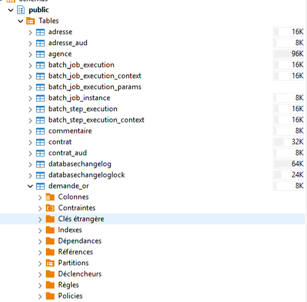

# Objectif de la tâche

L’objectif est **d’ajouter une nouvelle table `demande_or` dans la base SIOR** via **Liquibase**, en respectant la structure existante du projet **sans casser les données actuelles**, puis de préparer l’intégration backend (repository/service plus tard).

---

## Étape A — Création de l’entité JPA

Création de la classe Java représentant la table :

**Fichier** :
`src/main/java/nc/opt/sior/domain/DemandeOr.java`

```java
@Entity
@Table(name = "demande_or")
public class DemandeOr {

    @Id
    @GeneratedValue(strategy = GenerationType.IDENTITY)
    private Long id;

    @Column(name = "date_debut", nullable = false)
    private Instant dateDebut;

    @Column(name = "date_fin", nullable = false)
    private Instant dateFin;

    @Column(name = "nom_titulaire", nullable = false)
    private String nomTitulaire;

    @Column(name = "prenom_titulaire", nullable = false)
    private String prenomTitulaire;
}
```

---

## Étape B — Ajout du fichier Liquibase (ChangeSet)

Création du fichier permettant à Liquibase d’ajouter la table dans la base.

**Fichier** :
`src/main/resources/config/liquibase/changelog/20251029-01_added_table_demande_or.xml`

```xml
<databaseChangeLog ...>

    <changeSet id="20251029-01" author="anguyen">
        <createTable tableName="demande_or">
            <column name="id" type="BIGSERIAL">
                <constraints primaryKey="true" nullable="false"/>
            </column>
            <column name="date_debut" type="TIMESTAMP" />
            <column name="date_fin"  type="TIMESTAMP" />
            <column name="nom_titulaire" type="VARCHAR(255)" />
            <column name="prenom_titulaire" type="VARCHAR(255)" />
        </createTable>
    </changeSet>

</databaseChangeLog>
```

➡ Ajout obligatoire dans `master.xml` :

```xml
<include file="config/liquibase/changelog/20251029-01_added_table_demande_or.xml"/>
```

---

## Étape C — Exécution Liquibase (sans casser la base)

Commande utilisée pour **synchroniser uniquement cette nouvelle table**, sans rejouer tout l’historique :

```bash
./gradlew liquibaseChangeLogSync -Pliquibase.changelogFile=src/main/resources/config/liquibase/changelog/20251029-01_added_table_demande_or.xml
```

**Aucune autre table existante n’a été modifiée** (grâce à `changelogSync`).

Commande utilisée pour **synchroniser tout le contenu de la base**, sans rejouer tout l’historique :
```bash
./gradlew liquibaseUpdate
```

---
